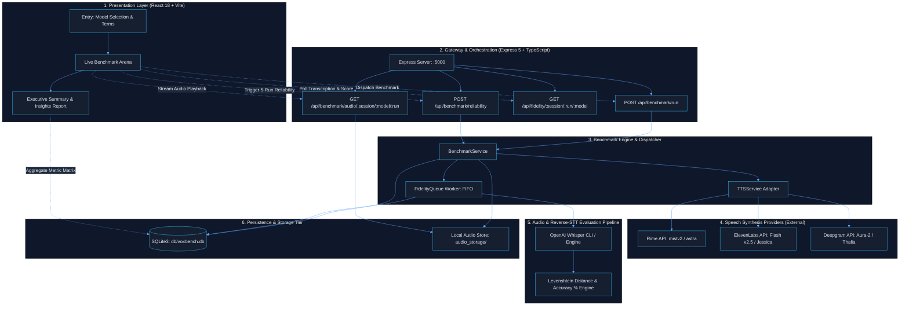

<div align="center">

# 🎙️ VoxBench
### Empirical Text-to-Speech (TTS) Benchmarking Suite for Voice AI

[](https://www.typescriptlang.org/)
[](https://react.dev/)
[](https://expressjs.com/)
[](https://tailwindcss.com/)
[](https://www.sqlite.org/)
[](https://github.com/openai/whisper)

**Never blindly pick a speech model.**  
VoxBench is an automated, reproducible benchmarking platform designed to evaluate and compare leading Text-to-Speech (TTS) models under demanding real-world conversational and clinical IVR constraints.

[Architecture](#-system-architecture) • [Benchmarking Protocol](#-benchmarking-protocol) • [Supported Models](#-supported-models) • [Quickstart](#-quickstart-guide) • [API Reference](#-api-reference)

---

</div>

## 📌 Problem Statement

Selecting a TTS engine for mission-critical voice applications (e.g., healthcare triage, pharmacy IVRs, automated customer support) is often driven by subjective demos or vendor latency claims tested in ideal scenarios. In production, voice engines suffer from:

1. **Phonetic Hallucinations & Distortions:** Stumbling on complex drug names (e.g., *Azathioprine*, *Lisinopril*), sound-alikes (*Celebrex* vs. *Celexa*), or decimal dosages (*0.5mg* heard as *50mg*).
2. **TTFB Latency Regressions:** Variability in Time to First Byte (TTFB) that degrades conversational turn-taking.
3. **Non-Determinism:** Inconsistent pronunciation and voice pitch across repeated invocations of the exact same prompt.
4. **Lack of Objective Auditing:** Inability to inspect generated audio side-by-side with ground-truth reverse transcriptions.

**VoxBench solves this** by running controlled, parallel benchmarks across top TTS providers, validating output fidelity using Whisper STT, executing multi-run determinism stress-tests, and scoring models across speed, fidelity, controllability, and reliability.

---

## 🏗️ System Architecture

VoxBench employs a decoupled full-stack architecture designed for asynchronous evaluation, background queue processing, and low-latency audio delivery.



---

## 🔬 Benchmarking Protocol

VoxBench grades every model run through four objective dimensions:

| Dimension | Metric | Formula / Protocol | Why It Matters |
| :--- | :--- | :--- | :--- |
| **1. Latency** | **TTFB** (Time to First Byte) | Measured in milliseconds from HTTP request dispatch until the first audio byte chunk arrives via stream. | Determines human conversational naturalness and bot interruption latency. |
| **2. Text Fidelity** | **Reverse-STT Accuracy** | Audio is transcribed via OpenAI Whisper (`base/tiny`), normalized, and scored against ground truth via Levenshtein distance:<br>`Accuracy = max(0, 100 * (1 - distance / len(input)))` | Verifies that medical dosages, clinical instructions, and names are correctly articulated without dropouts. |
| **3. Reliability** | **Determinism** | 5 consecutive runs with identical parameters:<br>`Determinism = 100 * (1 - unique_transcriptions / 5)` | Identifies whether model output fluctuates between calls or maintains consistent pronunciation. |
| **4. Controllability** | **Parameter Range** | Audit of speed range (`0.5x`–`2.0x`), pitch control, and phonetic/IPA pronunciation overrides. | Ensures system can handle patients requesting slower speech or regional accents. |

---

## 🤖 Supported Models

| Provider | Model ID | Voice ID | Style / Profile | Controllability Score |
| :--- | :--- | :--- | :--- | :---: |
| **Rime** *(Primary Anchor)* | `mistv2` | `astra` | Female, professional, neutral, sub-200ms latency profile | **100 / 100** |
| **ElevenLabs** | `eleven_flash_v2_5` | `FGY2WhTYpPnrIDTdsKH5` (Jessica) | Female, conversational, natural cadence | **75 / 100** |
| **Deepgram** | `aura-2` | `thalia` | Female, clear medical cadence, streaming-first | **60 / 100** |

---

## 💻 Tech Stack

### Frontend
- **Framework:** React 18 with TypeScript
- **Bundler:** Vite 6
- **Styling:** Tailwind CSS (custom dark-mode palette, glassmorphism, responsive grid)
- **Icons:** Lucide React
- **State Management:** Session-backed local persistence (`session.ts`) with deterministic aggregator

### Backend
- **Runtime:** Node.js (v18+) with Express 5
- **Language:** TypeScript 5
- **Database:** SQLite3 (WAL mode, parameterized queries, relational schema)
- **Transcription / STT:** Local OpenAI Whisper via Python/CLI with `ffmpeg-static`
- **Audio Processing:** Native Buffer streams & audio chunk caching

---

## ⚡ Quickstart Guide

### Prerequisites
1. **Node.js** v18.0.0 or higher
2. **Python 3.8+** with `whisper` installed:
   ```bash
   pip install -U openai-whisper
   ```
3. **API Keys** for:
   - [Rime AI](https://rime.ai)
   - [ElevenLabs](https://elevenlabs.io)
   - [Deepgram](https://deepgram.com)

---

### Installation

#### 1. Clone the repository
```bash
git clone https://github.com/your-username/VoxBench.git
cd VoxBench
```

#### 2. Backend Setup
```bash
cd backend
npm install
```

Create a `.env` file inside `backend/`:
```env
SERVER_PORT=5000
NODE_ENV=development

# Provider Credentials
RIME_API_KEY=your_rime_api_key
ELEVENLABS_API_KEY=your_elevenlabs_api_key
DEEPGRAM_API_KEY=your_deepgram_api_key

# Whisper Configuration (tiny / base / small)
WHISPER_MODEL=tiny
WHISPER_PYTHON=python
```

Start the backend server:
```bash
npm run dev
```
*Backend runs on `http://localhost:5000` (Health check at `http://localhost:5000/health`)*

#### 3. Frontend Setup
Open a new terminal:
```bash
cd frontend
npm install
npm run dev
```
*Frontend opens at `http://localhost:5173`*

---

## 📡 API Reference

### `GET /health`
Verifies backend status and configuration readiness.
```json
{
  "status": "ok",
  "timestamp": "2026-09-08T07:25:33.188Z"
}
```

---

### `POST /api/benchmark/run`
Executes an initial single-run benchmark across selected models.

**Payload:**
```json
{
  "text": "Your Lisinopril 10mg refill has been filled and is waiting for you.",
  "selectedModels": ["rime", "elevenlabs", "deepgram"],
  "category": "Normal"
}
```

**Response:**
```json
{
  "sessionId": "4bda7cb6-2c4a-4cd6-b27d-24cfce1daf0b",
  "runId": "6ae2a0c3-d366-4fb3-9088-e1f6800714c7",
  "results": {
    "rime": {
      "ttfb": 182,
      "fidelityId": "6ae2a0c3-d366-4fb3-9088-e1f6800714c7_rime",
      "audioUrl": "/api/benchmark/audio/4bda.../rime/6ae2...",
      "fidelityStatus": "processing",
      "status": "success"
    }
  },
  "timestamp": "2026-09-08T07:20:11.000Z"
}
```

---

### `POST /api/benchmark/reliability`
Runs 4 additional consecutive iterations to build a 5-run statistical sample for determinism and failure-rate analysis.

**Payload:**
```json
{
  "sessionId": "4bda7cb6-2c4a-4cd6-b27d-24cfce1daf0b",
  "text": "Your Lisinopril 10mg refill has been filled and is waiting for you.",
  "selectedModels": ["rime", "elevenlabs", "deepgram"],
  "category": "Normal"
}
```

---

### `GET /api/fidelity/:sessionId/:runId/:model`
Fetches reverse-STT accuracy, Levenshtein edit distance, and transcribed text.

**Response:**
```json
{
  "model": "rime",
  "status": "completed",
  "transcribed": "Your Lisinopril 10mg refill has been filled and is waiting for you.",
  "accuracy": 100.0,
  "editDistance": 0,
  "startedAt": "2026-09-08T07:20:12.000Z",
  "completedAt": "2026-09-08T07:20:14.000Z"
}
```

---

### `GET /api/benchmark/audio/:sessionId/:model/:runId`
Streams the generated `.mp3` audio binary for in-browser playback and auditory inspection.

---

## 🗄️ Database Schema

VoxBench persists all benchmark telemetry in SQLite (`backend/db/voxbench.db`):

```sql
CREATE TABLE sessions (
  id INTEGER PRIMARY KEY,
  sessionId TEXT UNIQUE NOT NULL,
  createdAt DATETIME DEFAULT CURRENT_TIMESTAMP
);

CREATE TABLE runs (
  id INTEGER PRIMARY KEY,
  sessionId TEXT NOT NULL,
  runId TEXT NOT NULL UNIQUE,
  inputText TEXT NOT NULL,
  category TEXT NOT NULL,
  timestamp DATETIME DEFAULT CURRENT_TIMESTAMP,
  FOREIGN KEY (sessionId) REFERENCES sessions(sessionId)
);

CREATE TABLE results (
  id INTEGER PRIMARY KEY,
  runId TEXT NOT NULL,
  model TEXT NOT NULL,
  ttfb INTEGER,
  audioPath TEXT,
  status TEXT DEFAULT 'success',
  createdAt DATETIME DEFAULT CURRENT_TIMESTAMP,
  FOREIGN KEY (runId) REFERENCES runs(runId),
  UNIQUE(runId, model)
);

CREATE TABLE fidelity (
  id INTEGER PRIMARY KEY,
  runId TEXT NOT NULL,
  model TEXT NOT NULL,
  transcribedText TEXT,
  editDistance INTEGER,
  accuracy REAL,
  status TEXT DEFAULT 'processing',
  error TEXT,
  startedAt DATETIME DEFAULT CURRENT_TIMESTAMP,
  completedAt DATETIME,
  FOREIGN KEY (runId) REFERENCES runs(runId),
  UNIQUE(runId, model)
);
```

---

## 📊 Evaluation Scoring Formula

In the Executive Summary screen, VoxBench computes a composite **Overall Score (0–100)** for each model:

$$\text{Overall Score} = 0.25 \cdot S_{\text{latency}} + 0.30 \cdot S_{\text{fidelity}} + 0.25 \cdot S_{\text{reliability}} + 0.20 \cdot S_{\text{controllability}}$$

Where:
- $S_{\text{latency}} = 100 \times \frac{\min(\text{latency}_{\text{all}})}{\text{latency}_{\text{model}}}$
- $S_{\text{fidelity}} = \text{Average Text Fidelity Accuracy } [0-100\%]$
- $S_{\text{reliability}} = 0.6 \cdot \text{Determinism} + 0.4 \cdot (100 \times (1 - \text{Failure Rate}))$
- $S_{\text{controllability}} = \text{Provider Capability Index } [0-100]$

---

## 🛡️ License

This project is licensed under the **MIT License**. Feel free to use, fork, and build upon it for research, production benchmarking, or hackathons.
